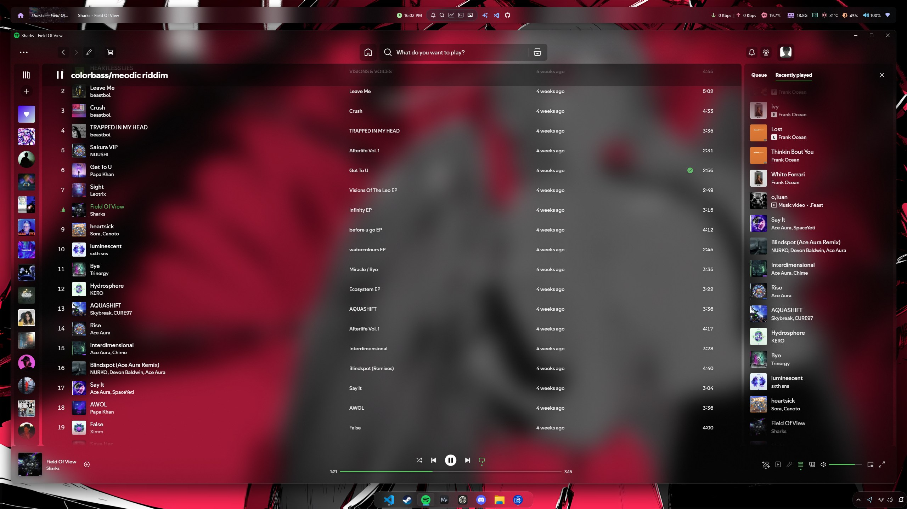

# Spicetify Configs

Uses Spicetify [v2.40.11](https://github.com/spicetify/cli/releases/tag/v2.40.11)

### Installing

1. Install the [Hazy](https://github.com/Astromations/Hazy) theme using Powershell.

```PowerShell
iwr -useb https://raw.githubusercontent.com/Astromations/Hazy/main/install.ps1 | iex
```

2. Replace the theme.js from the Haze theme dir with [theme.js](./theme.js)

_note: you can find the directory using `spicetify config-dir`, then go to Themes > Hazy._

# Screenshot


