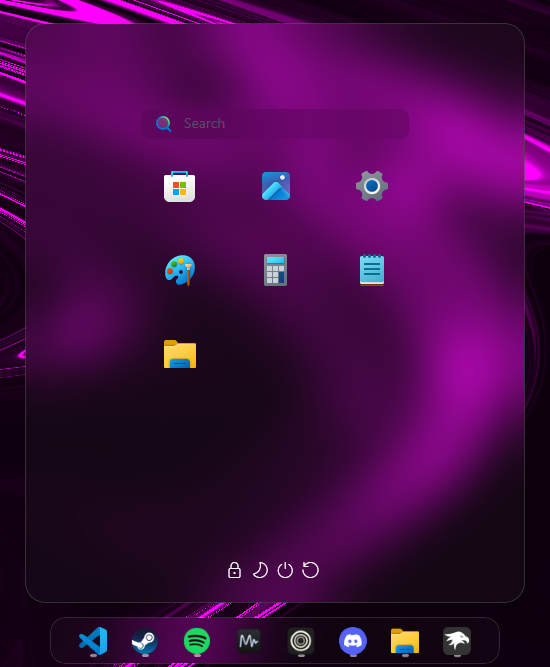

# Windhawk Configs

Uses Windhawk [v1.6.1](https://github.com/ramensoftware/windhawk/releases/tag/v1.6.1)

### Installing

Copy and paste the content of the json into the mods based on.

1. [Windows 11 Start Menu Styler](./mods/start_menu_styler.json)
2. [Windows 11 Taskbar Styler](./mods/taskbar_styler.json)
3. [CEF/Spotify Tweaks](./mods/cef-spotify_tweaks.json)
4. [Taskbar height and icon size](./mods/taskbar_icon.json)
5. Windows 11 Notification Center Styler > Choose TranslucentShell for the theme in the Settings of the mod.

# Screenshots

## 1. Taskbar

## 2. Start Menu

