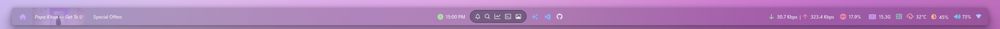
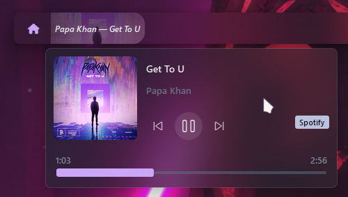
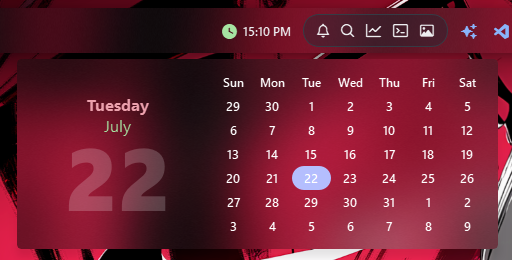
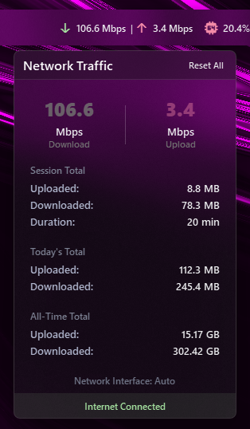

# YASB Configs

Uses YASB Reborn [v1.7.8](https://github.com/amnweb/yasb/releases/tag/v1.7.8)

### Installing

Copy and paste everything to your yasb config folder.

### Screenshots

1. Bar

2. Media menu

3. Calendar

4. Traffic menu

