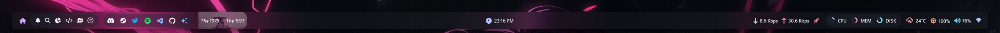
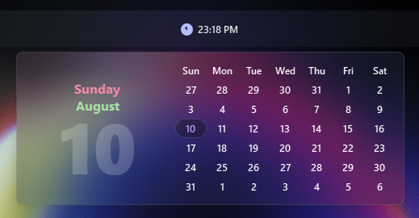
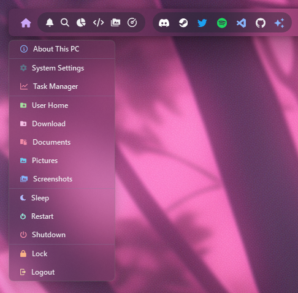

# YASB Configs

Uses YASB Reborn [latest](https://github.com/amnweb/yasb/releases/latest)

### Installing

Copy and paste everything to your yasb config folder.

Compile the content of the widget (or just copy the compiled ones), copy and paste it to the source of the yasb :

1. [`power_plan.pyc`](./widget/power_plan.pyc) copy and replace inside `C:\Program Files\YASB\lib\core\widgets\yasb`.
2. [`power_plan_schema.pyc`](./widget/power_plan_schema.pyc) copy to `C:\Program Files\YASB\lib\core\validation\widgets\yasb` and rename it to `power_plan.pyc`.

# Screenshots

## 1. Bar

## 2. Media menu

## 3. Calendar

## 4. Traffic menu

## 5. Home

