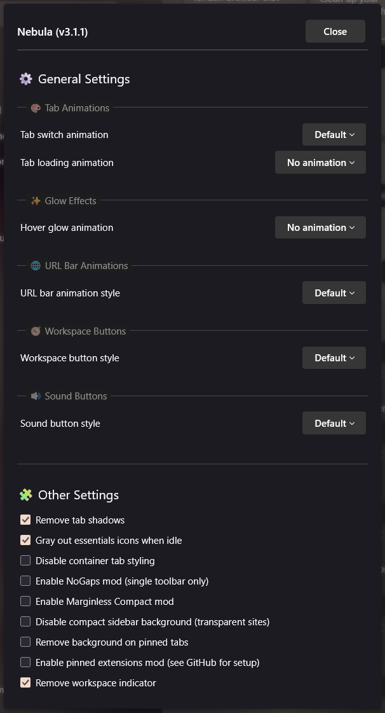
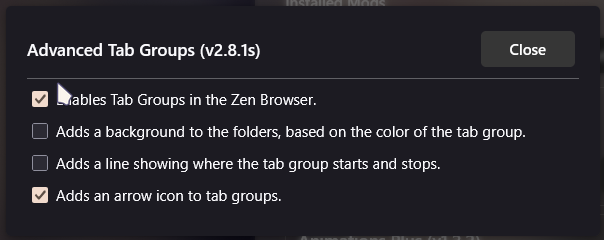
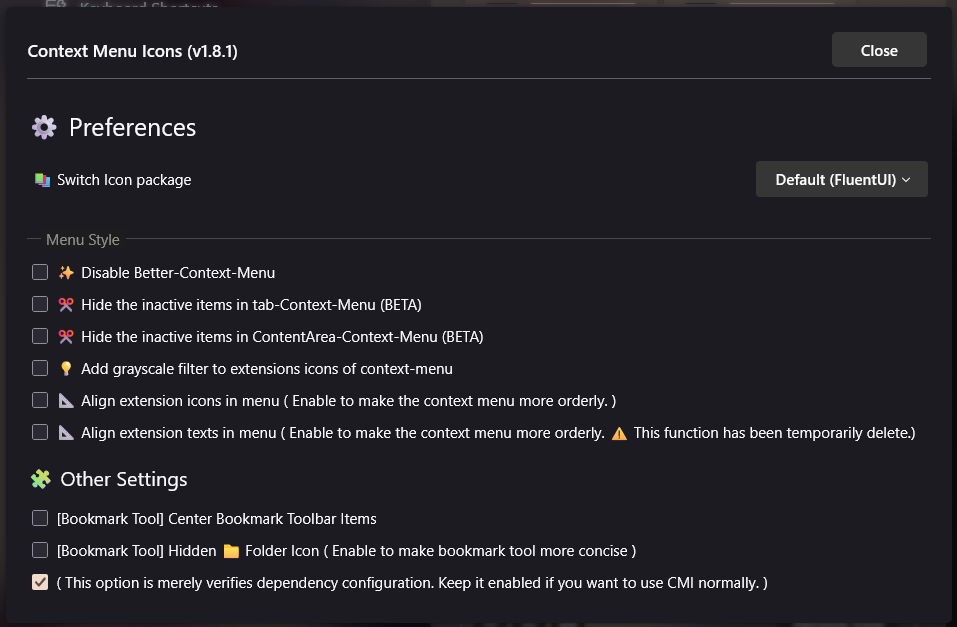
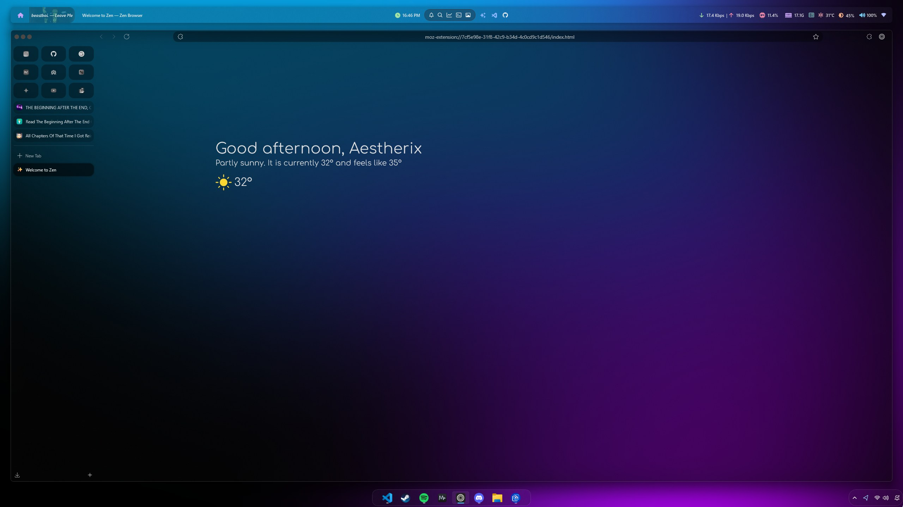
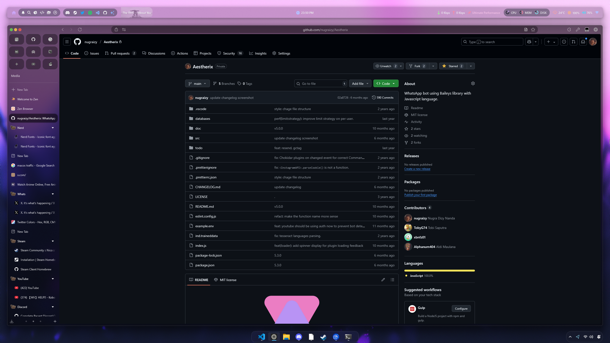
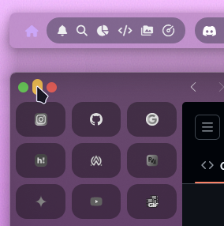

# Zen Browser Configs

Uses Zen Browser [latest](https://github.com/zen-browser/desktop/releases/latest), Sine Mods [latest](https://github.com/CosmoCreeper/Sine/releases/latest)

### Installing

1. Install Sine Mods, [guide](https://github.com/CosmoCreeper/Sine/wiki/Installation#-automatic-installation-recommended)
2. Installing mods :

2a. Nebula

</img>

2b. Advanced Tab Groups



2c. Animation Plus

2d. Context Menu Icons 

2e. Left close button

2f. Load Bar

3. Copy and paste the [MinimalExit.css](./module/MinimalExit.css) to the Nebula/modules folder. You can find the config folder using `about:profiles` on the url search bar in zen. Go to `chrome > sine-mods > Nebula > Nebula > modules`
4. Edit the Nebula.css and add this :

```css
@import 'modules/MinimalExit.css';
```

5. Comment this line in Nebula.css :

```css
@import 'modules/Workspace-buttons.css';
```

6. set `zen.view.experimental-force-window-controls-left` to `true` from the `about:config`

# Screenshots

## 1. Welcome Page



## 2. Github Page



## 3. Window Controls


