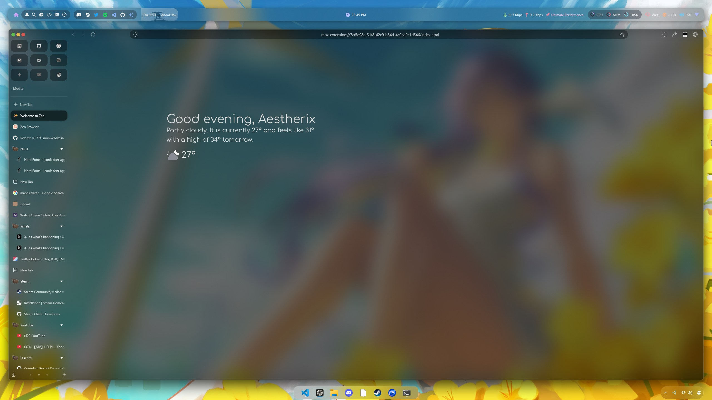

# Zen Browser Configs

Uses Zen Browser [v1.14.5b](https://github.com/zen-browser/desktop/releases/tag/1.14.5b), Sine Mods [v2.1.5](https://github.com/CosmoCreeper/Sine/releases/tag/v2.1.5)

### Installing

1. Install Sine Mods, [guide](https://github.com/CosmoCreeper/Sine/wiki/Installation#-automatic-installation-recommended)
2. Installing mods :
<details>
<summary>2a. Nebula</summary>

</details>
<details>
<summary>2b. Advanced Tab Groups</summary>

</details>
2c. Animation Plus
<details>
<summary>2d. Context Menu Icons</summary>

</details>
2e. Left close button

2f. Load Bar

3. Copy and paste the [MinimalExit.css](./module/MinimalExit.css) to the Nebula/modules folder. You can find the config folder using `about:profiles` on the url search bar in zen. Go to `chrome > sine-mods > Nebula > Nebula > modules`
4. Edit the Nebula.css and add this :

```css
@import 'modules/MinimalExit.css';
```

5. set `zen.view.experimental-force-window-controls-left` to `true` from the `about:config`

### Screenshots

<details>
<summary>1. Welcome Page</summary>

</details>

<details>
<summary>2. Github Page</summary>

</details>
